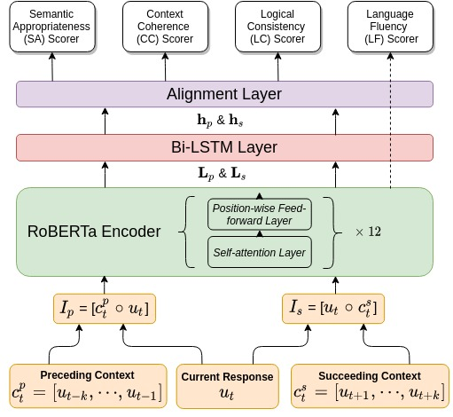

# D-score
</img>

D-score framework features several unique evaluation strategies. (1) D-score arrives at an overall judgement from several aspects, while the aspect judgements are built on a shared knowledge representation about the dialogue; (2) We consider that the quality of a dialogue turn should be judged not only by its preceding, but also its succeeding context; (3) We propose a range of appropriate sampling strategies for multi-task learning from human-human conversation data. 

## Prerequisite 
```
tensorflow=v1.15
best_checkpoint_copier
transformers=v2.11.0
```
## Resources

### checkpoints

#### D-score 
https://drive.google.com/drive/folders/18HHbd3kt3b1xc7_QCabKeWW2Dfyj5GSf?usp=sharing

#### Finetuned LM
https://drive.google.com/drive/folders/1WMF3FOXexb_D0U2WflRu066O622kxaq3?usp=sharing

### Datasets
#### DSTC6 Customer Support Dataset & The Human Evaluation Dataset
https://github.com/dialogtekgeek/DSTC6-End-to-End-Conversation-Modeling

For any use of the dataset, please cite
```
@article{hori2017end,
  title={End-to-end conversation modeling track in DSTC6},
  author={Hori, Chiori and Hori, Takaaki},
  journal={arXiv preprint arXiv:1706.07440},
  year={2017}
}
```

#### DSTC7 Knowledge Grounding Dataset & The Human Evaluation Dataset
https://github.com/mgalley/DSTC7-End-to-End-Conversation-Modeling

For any use of the dataset, please cite
```
@inproceedings{Galley2019GroundedRG,
  title={Grounded Response Generation Task at DSTC7},
  author={Michel Galley and Chris Brockett and Xiang Gao and Jianfeng Gao and B. Dolan},
  booktitle = {Dialog System Technology Challenges (DSTC7)},
  year={2019}
}
```
#### PERSONA-CHAT Dataset
https://github.com/facebookresearch/ParlAI/tree/master/projects/convai2

For any use of the dataset, please cite
```
@inproceedings{zhang2018personalizing,
  title={Personalizing Dialogue Agents: I have a dog, do you have pets too?},
  author={Zhang, Saizheng and Dinan, Emily and Urbanek, Jack and Szlam, Arthur and Kiela, Douwe and Weston, Jason},
  booktitle={Proceedings of the 56th Annual Meeting of the Association for Computational Linguistics (Volume 1: Long Papers)},
  pages={2204--2213},
  year={2018}
}
@article{dinan2019second,
  title={The second conversational intelligence challenge (convai2)},
  author={Dinan, Emily and Logacheva, Varvara and Malykh, Valentin and Miller, Alexander and Shuster, Kurt and Urbanek, Jack and Kiela, Douwe and Szlam, Arthur and Serban, Iulian and Lowe, Ryan and others},
  journal={arXiv preprint arXiv:1902.00098},
  year={2019}
}
@article{miller2017parlai,
  title={ParlAI: A Dialog Research Software Platform},
  author={{Miller}, A.~H. and {Feng}, W. and {Fisch}, A. and {Lu}, J. and {Batra}, D. and {Bordes}, A. and {Parikh}, D. and {Weston}, J.},
  journal={arXiv preprint arXiv:{1705.06476}},
  year={2017}
}
```

#### PERSONA-Chatlog Dataset
https://github.com/facebookresearch/ParlAI/tree/master/projects/controllable_dialogue

For any use of the dataset, please cite
```
@inproceedings{see2019makes,
  title={What makes a good conversation? How controllable attributes affect human judgments},
  author={See, Abigail and Roller, Stephen and Kiela, Douwe and Weston, Jason},
  booktitle={Proceedings of the 2019 Conference of the North American Chapter of the Association for Computational Linguistics: Human Language Technologies, Volume 1 (Long and Short Papers)},
  pages={1702--1723},
  year={2019}
}
@article{miller2017parlai,
  title={ParlAI: A Dialog Research Software Platform},
  author={{Miller}, A.~H. and {Feng}, W. and {Fisch}, A. and {Lu}, J. and {Batra}, D. and {Bordes}, A. and {Parikh}, D. and {Weston}, J.},
  journal={arXiv preprint arXiv:{1705.06476}},
  year={2017}
}
```

#### USR-PERSONA Dataset
http://shikib.com/usr

For any use of the dataset, please cite
```
@article{mehri2020usr,
  title={USR: An Unsupervised and Reference Free Evaluation Metric for Dialog Generation},
  author={Mehri, Shikib and Eskenazi, Maxine},
  journal={arXiv preprint arXiv:2005.00456},
  year={2020}
}
```
### Experiment Results

#### Confidence Scores
https://drive.google.com/drive/folders/1tlIZ4MoqpwBmIumyM8chZOU58K8_Yj9i?usp=sharing

## Traing Procedure of D-score
D-score is trained with high-quality human-human conversations. Even though for our experiments, we used
the DSTC6 Customer Suppport, DSTC7 Knowledge-grounding and PERSONA-CHAT datasets, the framework is can be
also applied in other domains.
```
python main.py
  --data_dir {Path To Data Directory} \
  --roberta_config_file {Path To Roberta Base Model Config File} \
  --output_dir {Path To Save Checkpoints and Intermediate Files} \
  --corpus_name {Name of Corpus for Training: persona | dstc6 | dstc7} \
  --init checkpoint {Path To Finetuned LM} \
  --dropout_rate {default: 0.5} \
  --l2_reg_lambda {default: 0.1} \
  --batch_size {default: 8} \
  --dupe_factor {default: 5} \
  --max_pre_len {max length of previous context} \
  --max_post_len {max length of succeeding context} \
  --max_seq_len {max length of the current response} \
  --window_size {the value of K, actually here K refers to the total number 
                of utterances including the pre-, post- and current utterances} \
  --lstm_size {default: 300} \
  --keep_checkpoint_max {default: 5} \
  --do_train \
  --do_eval \
  --learning_rate {default:1e-5}
```
## Evaluation Procedure of D-score
The evaluation process with generate a file containing all the confidence scores from the four scorers.
```
python main.py
  --data_dir {Path To Data Directory} \
  --roberta_config_file {Path To Roberta Base Model Config File} \
  --output_dir {Path To Save Checkpoints and Intermediate Files} \
  --corpus_name {Name of Corpus for Evaluation: persona | dstc6 | dstc7} \
  --init checkpoint {Path To Finetuned LM} \
  --max_pre_len {max length of previous context} \
  --max_post_len {max length of succeeding context} \
  --max_seq_len {max length of the current response} \
  --window_size {the value of K, actually here K refers to the total number 
                of utterances including the pre-, post- and current utterances} \
  --do_predict
```

<hr>

# 2020-11-17 

Start maintaining a simplified pytorch-version at branch `torch`.

